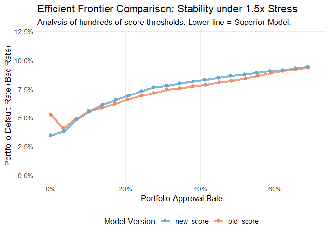
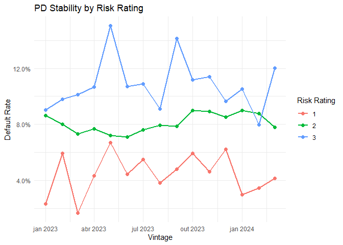

<!-- README.md is generated from README.Rmd. Please edit that file -->

# creditools 

<!-- badges: start -->

[](https://lifecycle.r-lib.org/articles/stages.html#experimental)
<!-- badges: end -->

**creditools** is a professional R framework designed for Credit Risk
Strategy and Decision Science. It provides the mathematical
infrastructure to simulate, optimize, and validate complex credit
policies, moving beyond static backtesting into the realm of
**Counterfactual Policy Simulation**.

In modern credit risk management, the most significant challenge is
“Selection Bias”: you only know the performance of applicants you have
already **approved**. When you evaluate a new policy, `creditools` fills
this gap by modeling “Swap-Ins” (the rejected who would be approved) and
“Swap-Outs” (the approved who would now be rejected).

## Technical Workflow: A Step-by-Step Guide

### 1. Counterfactual Portfolio Simulation (Vigente vs. Challenger)

The first step in any policy revision is understanding how the
transition impacts your portfolio metrics. We use the **Analytical
Reweighting** engine to calculate expected values deterministically.

In this scenario, we evaluate a new score with a **1.5x Aggravation
Factor** for the newly approved population (Swap-Ins). This accounts for
the higher uncertainty inherent in previously rejected applicants.

``` r
# Load built-in professional dataset (20,000 observations)
data(applicants)

# Run a deterministic analytical simulation with 1.5x stress
results <- simulate_from_data(
  data = applicants,
  current_score_col = "old_score",
  new_score_col     = "new_score",
  new_score_cutoff  = 640,
  aggravation_factor = 1.5,
  method = "analytical"
)

# Transition Summary:
# Note: Bad_Rate for 'swap_out' and 'keep_out' shows their HISTORICAL observed performance.
results$summary %>%
  mutate(Bad_Rate = percent(Bad_Rate, accuracy = 0.01)) %>%
  kbl(caption = "Portfolio Transition Analysis (1.5x Swap-In Stress)") %>%
  kable_styling(bootstrap_options = c("striped", "hover"), full_width = FALSE)
```

<table class="table table-striped table-hover" style="width: auto !important; margin-left: auto; margin-right: auto;">

<caption>

Portfolio Transition Analysis (1.5x Swap-In Stress)
</caption>

<thead>

<tr>

<th style="text-align:left;">

scenario
</th>

<th style="text-align:right;">

Applicants
</th>

<th style="text-align:right;">

Approved
</th>

<th style="text-align:right;">

Hired
</th>

<th style="text-align:left;">

Bad_Rate
</th>

</tr>

</thead>

<tbody>

<tr>

<td style="text-align:left;">

keep_in
</td>

<td style="text-align:right;">

5826
</td>

<td style="text-align:right;">

5826
</td>

<td style="text-align:right;">

3276.902
</td>

<td style="text-align:left;">

7.05%
</td>

</tr>

<tr>

<td style="text-align:left;">

keep_out
</td>

<td style="text-align:right;">

8670
</td>

<td style="text-align:right;">

0
</td>

<td style="text-align:right;">

0.000
</td>

<td style="text-align:left;">

13.03%
</td>

</tr>

<tr>

<td style="text-align:left;">

swap_in
</td>

<td style="text-align:right;">

1314
</td>

<td style="text-align:right;">

1314
</td>

<td style="text-align:right;">

772.130
</td>

<td style="text-align:left;">

11.75%
</td>

</tr>

<tr>

<td style="text-align:left;">

swap_out
</td>

<td style="text-align:right;">

4190
</td>

<td style="text-align:right;">

0
</td>

<td style="text-align:right;">

0.000
</td>

<td style="text-align:left;">

9.74%
</td>

</tr>

</tbody>

</table>

- **swap_in**: The “New Blood”. Applicants previously rejected but now
  approved. Their Bad_Rate is simulated with 1.5x stress.
- **swap_out**: The “Risk Reduction”. Historically approved applicants
  that the new model identifies as high risk. **The Bad_Rate here
  reflects their real historical default**, showing exactly which losses
  you are pruning.

------------------------------------------------------------------------

### 2. Multi-Model Optimization (The Efficient Frontier)

Choosing a model based on Gini or AUC is insufficient for business
planning. You need to know which model provides the most **Approval
Volume** for the same **Portfolio Bad Rate**.

`creditools` can analyze hundreds of score/cutoff combinations at once
to map their “Efficient Frontier.” Below, we compare the frontiers of
the legacy model versus the new ML model, restricted to a realistic
**0-70% Approval Rate** for professional aesthetics.

``` r
# Generate a larger synthetic population (50,000) for high-resolution curves
sim_data <- generate_sample_data(n_applicants = 50000, seed = 123)

get_frontier_data <- function(score_col) {
  opt <- find_optimal_cutoffs(
    data = sim_data,
    config = credit_policy(
      applicant_id_col = "id",
      score_cols = score_col,
      current_approval_col = "approved",
      actual_default_col = "defaulted"
    ) %>% add_stress_scenario(stress_aggravation(factor = 1.5)),
    cutoff_steps = 30,
    target_default_rate = 0.12,
    method = "analytical"
  )
  analysis <- analyze_tradeoffs(opt)
  df <- analysis$pareto_frontier
  df$model <- score_col
  return(df)
}

comparison_df <- map_dfr(c("old_score", "new_score"), get_frontier_data)

ggplot(comparison_df, aes(x = overall_approval_rate, y = overall_default_rate, color = model)) +
  geom_line(size = 1.5, alpha = 0.8) +
  geom_point(size = 2.5) +
  scale_y_continuous(labels = percent_format(), limits = c(0, 0.12)) +
  scale_x_continuous(labels = percent_format(), limits = c(0, 0.70)) +
  scale_color_manual(values = c("old_score" = "#ef8a62", "new_score" = "#67a9cf")) +
  labs(
    title = "Efficient Frontier Comparison: Stability under 1.5x Stress",
    subtitle = "Analysis of hundreds of score thresholds. Lower line = Superior Model.",
    x = "Portfolio Approval Rate",
    y = "Portfolio Default Rate (Bad Rate)",
    color = "Model Version"
  ) +
  theme_minimal(base_size = 13) +
  theme(legend.position = "bottom", panel.grid.minor = element_blank())
```



------------------------------------------------------------------------

### 3. Iso-Approval Analysis: The Decision Table

The core business question often is: *“If we keep the same internal
approval volume, how much can we lower the Bad Rate?”*

``` r
# Baseline: Current Old Score Approval (~45%)
current_approval <- mean(sim_data$approved)
current_bad_rate <- mean(sim_data$defaulted[sim_data$approved == 1], na.rm = TRUE)

# New Policy: Finding the point on the New Score frontier with the same approval
iso_policy <- find_equivalent_policy(
  tradeoff_results = comparison_df %>% filter(model == "new_score"),
  target_metric = "approval_rate",
  target_value = current_approval,
  tolerance = 0.05
) %>% slice(1)

# Summary Comparison
iso_summary <- tibble(
  Metric = c("Approval Rate", "Portfolio Bad Rate"),
  `Current Strategy (Old)` = c(percent(current_approval), percent(current_bad_rate)),
  `Proposed Strategy (New)` = c(percent(iso_policy$overall_approval_rate), percent(iso_policy$overall_default_rate)),
  Delta = c("0.0%", percent(iso_policy$overall_default_rate - current_bad_rate, accuracy = 0.01))
)

iso_summary %>%
  kbl(caption = "Iso-Approval Impact Analysis (Business Decision Support)") %>%
  kable_styling(bootstrap_options = c("striped", "hover"), full_width = FALSE)
```

<table class="table table-striped table-hover" style="width: auto !important; margin-left: auto; margin-right: auto;">

<caption>

Iso-Approval Impact Analysis (Business Decision Support)
</caption>

<thead>

<tr>

<th style="text-align:left;">

Metric
</th>

<th style="text-align:left;">

Current Strategy (Old)
</th>

<th style="text-align:left;">

Proposed Strategy (New)
</th>

<th style="text-align:left;">

Delta
</th>

</tr>

</thead>

<tbody>

<tr>

<td style="text-align:left;">

Approval Rate
</td>

<td style="text-align:left;">

50%
</td>

<td style="text-align:left;">

52%
</td>

<td style="text-align:left;">

0.0%
</td>

</tr>

<tr>

<td style="text-align:left;">

Portfolio Bad Rate
</td>

<td style="text-align:left;">

8%
</td>

<td style="text-align:left;">

9%
</td>

<td style="text-align:left;">

0.50%
</td>

</tr>

</tbody>

</table>

------------------------------------------------------------------------

### 4. Ward Clustering: Monotonic Risk Segmentation

For Risk Based Pricing (RBP), you need stable risk bands (Risk Ratings).
Standard methods (quantiles) often produce non-monotonic results in
low-default segments.

`creditools` implements **Agglomerative Hierarchical Clustering using
Ward’s Method**, modified to strictly enforce monotonicity.

#### The Mathematical Foundation

The merging process minimizes the increase in the **Expected Sum of
Squares (ESS)** at each step:

``` math
 d_{ij} = \frac{n_i n_j}{n_i + n_j} || \bar{x}_i - \bar{x}_j ||^2 
```

Where $`n_i`$ is the volume in cluster $`i`$ and $`\bar{x}_i`$ is the
centroid (mean default rate). This minimizes the intra-cluster variance,
while `creditools` ensures that the final $`N`$ groups follow a strictly
increasing risk order, preventing “noisy” reversals in the Risk Matrix.

``` r
# Create 20 micro-bins and merge them into 5 stable, monotonic Risk Ratings
risk_groups <- find_risk_groups(
  data = sim_data %>% filter(approved == 1),
  score_cols = "new_score",
  default_col = "defaulted",
  time_col = "vintage",
  bins = 20,
  max_groups = 5,
  min_vol_ratio = 0.02
)

# Visualize stability and monotonicity across historical cohorts
plot(risk_groups)
```



------------------------------------------------------------------------

## Capabilities Summary

`creditools` is built for industry-scale deployment: - **Massive
Analysis**: Evaluate hundreds of scores and cutoff combinations
simultaneously. - **Hierarchical Matrixing**: Generate stable, monotonic
Risk Matrices (RBP) across multiple score dimensions. - **Governance**:
A deterministic, reproducible framework for Justification and Model
Transition documentation.

## Installation

``` r
# install.packages("devtools")
devtools::install_github("matheuspasche/creditools")
```

## Documentation

For a detailed case study involving multi-stage funnel optimization,
see: `vignette("multi-stage-funnel", package = "creditools")`
