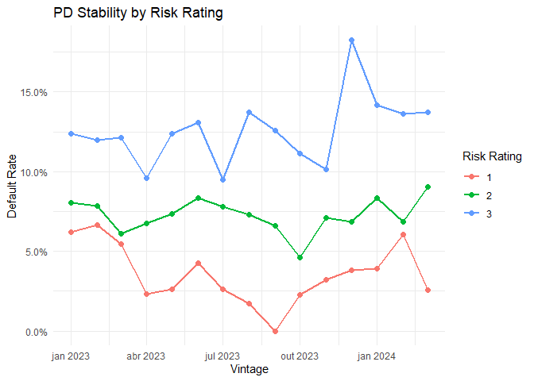

<!-- README.md is generated from README.Rmd. Please edit that file -->

# creditools 

<!-- badges: start -->

[](https://lifecycle.r-lib.org/articles/stages.html#experimental)
<!-- badges: end -->

The goal of **creditools** is to put the computational power of an
entire risk analytics team into a single, scalable R package. It
provides a flexible framework for mathematically simulating and
optimizing credit policies, now featuring **Analytical Reweighting** for
deterministic, noise-free analysis.

## Why creditools? (The Business Value)

In modern credit risk management, finding the sweet spot of
profitability requires testing endless permutations. `creditools` was
designed to answer complex business questions in minutes:

- **⚡ Analytical vs. Stochastic:** Choose between row-by-row sampling
  (`stochastic`) or expected-value calculation (`analytical`). The
  latter provides instant, deterministic results for tradeoff analysis.
- **🎯 Optimal Efficient Frontier:** Automatically discover the exact
  cutoffs needed to hit a target default rate while maximizing approval
  volume.
- **🧪 Surgical Stress Testing:** Inject custom stress scenarios for
  “swap-ins” (newly approved clients) to account for unsupervised risk.
- **🌊 Multi-Stage Funnels:** Model complex chains of decisions (Filters
  → Cutoffs → Conversion → Anti-Fraud) using a clean, pipeable syntax.

## Installation

``` r
# install.packages("devtools")
devtools::install_github("matheuspasche/creditools")
```

------------------------------------------------------------------------

## 🚀 Quick Start: Analytical Tradeoff

If you have a historical dataset, you can run a full policy impact
analysis in seconds. Using the new `analytical` method, we calculate the
**expected impact** without sampling noise.

``` r
# 1. Generate sample data (100k applicants)
data <- generate_sample_data(n_applicants = 100000, complex_demographics = TRUE, seed = 42)

# 2. Run high-level simulation with Analytical Method
results <- simulate_from_data(
  data = data,
  current_score_col = "old_score",
  new_score_col = "new_score",
  new_score_cutoff = 600,
  aggravation_factor = 1.30, # 30% stress on Swap-Ins
  method = "analytical"
)

# 3. View the Business Summary with Premium Formatting
results$summary %>%
  kbl(caption = "Analytical Simulation Results (Expected Values)") %>%
  kable_styling(bootstrap_options = c("striped", "hover", "condensed"), full_width = FALSE) %>%
  column_spec(5, bold = TRUE, color = "darkred")
```

<table class="table table-striped table-hover table-condensed" style="width: auto !important; margin-left: auto; margin-right: auto;">

<caption>

Analytical Simulation Results (Expected Values)
</caption>

<thead>

<tr>

<th style="text-align:left;">

scenario
</th>

<th style="text-align:right;">

Applicants
</th>

<th style="text-align:right;">

Approved
</th>

<th style="text-align:right;">

Hired
</th>

<th style="text-align:right;">

Bad_Rate
</th>

</tr>

</thead>

<tbody>

<tr>

<td style="text-align:left;">

keep_in
</td>

<td style="text-align:right;">

31847
</td>

<td style="text-align:right;">

31847
</td>

<td style="text-align:right;">

18231.887
</td>

<td style="text-align:right;font-weight: bold;color: darkred !important;">

0.0702589
</td>

</tr>

<tr>

<td style="text-align:left;">

keep_out
</td>

<td style="text-align:right;">

41947
</td>

<td style="text-align:right;">

0
</td>

<td style="text-align:right;">

0.000
</td>

<td style="text-align:right;font-weight: bold;color: darkred !important;">

0.0000000
</td>

</tr>

<tr>

<td style="text-align:left;">

swap_in
</td>

<td style="text-align:right;">

8020
</td>

<td style="text-align:right;">

8020
</td>

<td style="text-align:right;">

4818.988
</td>

<td style="text-align:right;font-weight: bold;color: darkred !important;">

0.0988651
</td>

</tr>

<tr>

<td style="text-align:left;">

swap_out
</td>

<td style="text-align:right;">

18186
</td>

<td style="text-align:right;">

0
</td>

<td style="text-align:right;">

0.000
</td>

<td style="text-align:right;font-weight: bold;color: darkred !important;">

0.0000000
</td>

</tr>

</tbody>

</table>

------------------------------------------------------------------------

## 🛠️ Building Complex Funnels

Most credit policies involve more than just a score. Use `add_stage()`
to build a realistic acquisition funnel.

``` r
# Define a multi-stage policy
policy <- credit_policy(
  applicant_id_col = "id",
  score_cols = "new_score",
  current_approval_col = "approved",
  actual_default_col = "defaulted"
) %>%
  add_stage(stage_filter(name = "age_check", condition = "age >= 18")) %>%
  add_stage(stage_cutoff(name = "credit_score", cutoffs = list(new_score = 550))) %>%
  add_stage(stage_rate(name = "conversion", base_rate = 0.65))

# Run the simulation
sim_res <- run_simulation(data, policy, method = "analytical")

# Plot the scenario composition
plot(sim_res)
```


------------------------------------------------------------------------

## 📈 Optimization & Tradeoff Analysis

Find the “Efficient Frontier” of your policy by varying cutoffs and
stress factors.

``` r
# Define parameters to vary
vary_params <- list(
  new_score_cutoff = seq(450, 750, by = 50),
  aggravation_factor = c(1.0, 1.3, 1.6)
)

# Run tradeoff analysis using the analytical engine (fast & deterministic)
tradeoff <- find_optimal_cutoffs(
  data = data,
  config = policy,
  cutoff_steps = 10,
  target_default_rate = 0.08,
  method = "analytical"
)

tradeoff %>%
  head(5) %>%
  kbl(caption = "Optimization Grid (Top 5 Scenarios)") %>%
  kable_styling(bootstrap_options = c("striped", "condensed"), full_width = FALSE)
```

<table class="table table-striped table-condensed" style="width: auto !important; margin-left: auto; margin-right: auto;">

<caption>

Optimization Grid (Top 5 Scenarios)
</caption>

<thead>

<tr>

<th style="text-align:right;">

combination_id
</th>

<th style="text-align:right;">

overall_approval_rate
</th>

<th style="text-align:right;">

overall_default_rate
</th>

<th style="text-align:left;">

constraints_met
</th>

<th style="text-align:right;">

tradeoff_score
</th>

<th style="text-align:right;">

new_score
</th>

</tr>

</thead>

<tbody>

<tr>

<td style="text-align:right;">

1
</td>

<td style="text-align:right;">

0.291408
</td>

<td style="text-align:right;">

0
</td>

<td style="text-align:left;">

FALSE
</td>

<td style="text-align:right;">

0.291408
</td>

<td style="text-align:right;">

0
</td>

</tr>

</tbody>

</table>

------------------------------------------------------------------------

## 💎 Advanced: Risk Matrix & Stability

Use `find_risk_groups()` to bin multiple scores into a stable Risk
Matrix, ensuring that your risk ratings remain consistent across
historical vintages.

``` r
# Find stable risk groups across 2 scores
rbp <- find_risk_groups(
  data = data %>% filter(approved == 1),
  score_cols = c("old_score", "new_score"),
  default_col = "defaulted",
  time_col = "vintage",
  bins = 5
)

# Plot the default rate stability by vintage
plot(rbp)
```



------------------------------------------------------------------------

## 📖 Learn More

Check the vignettes for deep dives into real-world use cases: - [Case
Study: Used Vehicles](vignettes/case-study-used-vehicles.html) -
[Tradeoff Analysis & Optimization](vignettes/tradeoff-analysis.html)
