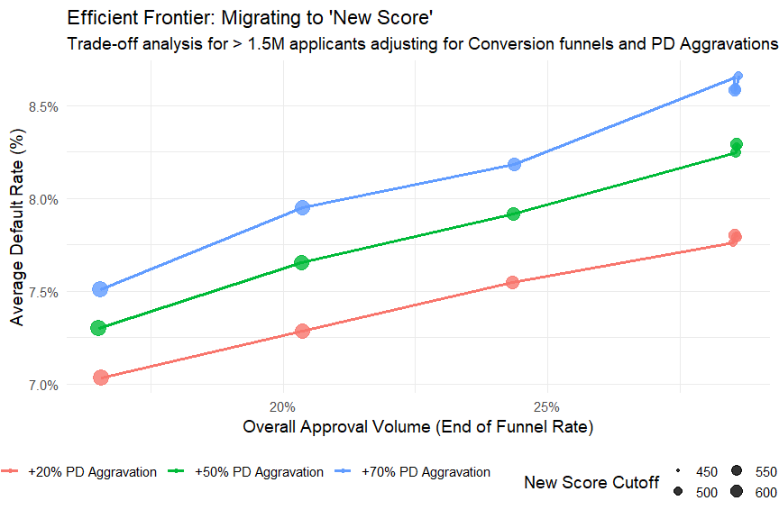

<!-- README.md is generated from README.Rmd. Please edit that file -->

# creditools 

<!-- badges: start -->

[](https://lifecycle.r-lib.org/articles/stages.html#experimental)
<!-- badges: end -->

> **Put the computational power of an entire risk analytics team into a
> single, scalable R package.**

`creditools` is a framework for mathematically simulating and optimizing
credit policies. Instead of spending weeks writing ad-hoc code to
backtest a single score, `creditools` lets risk analysts model
multi-stage decision funnels, simulate swap-in/swap-out impacts, extract
efficient frontiers, and build **stable Risk Based Pricing (RBP)
matrices** — all in minutes.

## Why creditools?

| Question | How creditools answers it |
|---|---|
| Which challenger score wins? | Simulate N scores simultaneously; compare default rates at equal approval |
| What cutoff should I set? | Run `run_tradeoff_analysis()` to extract the efficient frontier |
| How bad will swap-ins be? | Inject custom stress scenarios per risk segment |
| Which risk groups are stable over time? | `find_risk_groups()` runs Ward Agglomerative Clustering — **zero inter-group crossings guaranteed** |
| Can I handle 5M applicants? | Native `future` parallel processing support |

## Installation

``` r
# install.packages("devtools")
devtools::install_github("matheuspasche/creditools")
```

## Core Concepts

The package is organized around three layers:

1.  **Policy** — `credit_policy()` holds all configuration: column
    mappings, decision stages, and stress scenarios.
2.  **Stages** — Sequential filters applied to the applicant funnel:
    `stage_cutoff()`, `stage_rate()`, `stage_filter()`.
3.  **Engines** — `run_simulation()` runs one policy; `run_tradeoff_analysis()`
    sweeps a parameter grid in parallel; `find_risk_groups()` clusters
    into stable risk tiers.

---

## Example 1: Multi-Stage Simulation

``` r
library(creditools)
library(dplyr)
library(future)

future::plan(multisession)  # Parallel processing

sample_data <- generate_sample_data(n_applicants = 1500000, seed = 42)
sample_data$new_score_decile <- dplyr::ntile(sample_data$new_score, 10)
```

### Define funnel stages and policy

``` r
base_policy <- credit_policy(
  applicant_id_col   = "id",
  score_cols         = c("old_score", "new_score"),
  current_approval_col = "approved",
  actual_default_col = "defaulted",
  risk_level_col     = "new_score_decile",
  simulation_stages  = list(
    stage_cutoff("credit_decision", cutoffs = list(new_score = 600)),
    stage_rate("anti_fraud",  base_rate = 0.95),
    stage_rate("conversion",  base_rate = 0.70)
  ),
  stress_scenarios = list(
    stress_aggravation(factor = 1.3, by = "new_score_decile")
  )
)
```

### Granular single run

``` r
single_run <- run_simulation(data = sample_data, policy = base_policy, quiet = TRUE)

single_run$data %>%
  filter(scenario == "swap_in") %>%
  select(id, old_score, new_score, new_approval, simulated_default) %>%
  head()
#> # A tibble: 6 x 5
#>      id old_score new_score new_approval simulated_default
#>   <int>     <dbl>     <dbl> <lgl>                    <int>
#> 1     4       346       913 TRUE                         0
#> 2    29       417       775 TRUE                         0
#> 3    35       271       663 TRUE                         1
```

### Parallel trade-off analysis

``` r
tradeoff_results <- run_tradeoff_analysis(
  data        = sample_data,
  base_policy = base_policy,
  vary_params = list(
    new_score_cutoff   = seq(450, 750, by = 50),
    aggravation_factor = c(1.2, 1.5, 1.7)
  ),
  parallel = TRUE,
  quiet    = TRUE
)

head(tradeoff_results)
#> # A tibble: 6 x 4
#>   new_score_cutoff aggravation_factor approval_rate default_rate
#>              <dbl>              <dbl>         <dbl>        <dbl>
#> 1              450                1.2         0.286       0.0781
#> 2              450                1.5         0.286       0.0828
#> 3              500                1.2         0.285       0.0776
```

### Visualize the efficient frontier

``` r
tradeoff_results %>%
  mutate(Stress = paste0("+", round((aggravation_factor - 1) * 100), "% PD")) %>%
  ggplot(aes(x = approval_rate, y = default_rate, color = Stress)) +
  geom_line(linewidth = 1.2) +
  geom_point(aes(size = new_score_cutoff), alpha = 0.8) +
  scale_x_continuous(labels = scales::percent_format(accuracy = 1)) +
  scale_y_continuous(labels = scales::percent_format(accuracy = 0.1)) +
  labs(
    title    = "Efficient Frontier: Migrating to New Score",
    subtitle = "> 1.5M applicants | Multi-stage funnel | Custom PD stress",
    x = "Approval Rate", y = "Default Rate", size = "Cutoff"
  ) +
  theme_minimal(base_size = 14)
```



---

## Example 2: Hard Filters + Risk Based Pricing Matrix

`find_risk_groups()` runs a **Ward Agglomerative Clustering** algorithm
on any combination of scores. It merges bins iteratively using the Ward
distance:

$$\Delta_{A,B} = \frac{V_A \cdot V_B}{V_A + V_B}(PD_A - PD_B)^2$$

Merges are only accepted if all three constraints hold:

| Priority | Constraint | Parameter |
|---|---|---|
| 1 | Monotonicity — PD must increase with group | automatic |
| 2 | Minimum volume per group | `min_vol_ratio` |
| 3 | Max inter-group crossings over time | `max_crossings` |
| 4 | Tail compression (optional cap) | `max_groups` |

The `max_crossings` parameter uses **absolute count of months** where
two adjacent groups invert — making it robust to small vintage windows
(6–18 months). Setting `max_crossings = 1` means at most 1 month of
inversion is tolerated before a forced merge.

### Filter approved population, then cluster

``` r
# 1. Apply hard filters (categorical + score cutoff)
advanced_policy <- credit_policy(
  applicant_id_col     = "id",
  score_cols           = c("old_score", "new_score"),
  current_approval_col = "approved",
  actual_default_col   = "defaulted",
  simulation_stages    = list(
    stage_filter("valid_segment", condition = "status == 'Approved'"),
    stage_cutoff("baseline",      cutoffs   = list(old_score = 300))
  )
)

approved_base <- run_simulation(sample_data, advanced_policy, quiet = TRUE)$data %>%
  filter(new_approval == TRUE)

# 2. Run Ward Agglomerative Clustering on approved population
# Best practice: train on approved totals (includes defaulters) —
# this preserves the PD signal while removing the rejected left-tail.
rbp_result <- find_risk_groups(
  data          = approved_base,
  score_cols    = c("old_score", "new_score"),
  default_col   = "defaulted",
  time_col      = "vintage_month",  # Must be Date or POSIXt
  bins          = 10,               # 10x10 = 100 initial cells
  min_vol_ratio = 0.05,             # Groups must be >= 5% of population
  max_crossings = 1L,               # At most 1 month of PD inversion allowed
  max_groups    = 7,                # Compress tail into at most 7 groups
  oot_date      = as.Date("2023-11-01")  # Hold-out for OOT validation
)

# 3. Inspect the output
rbp_result$report
#> # A tibble: 14 x 4
#>    risk_rating period total_vol avg_pd
#>          <int> <chr>      <int>  <dbl>
#>  1           1 Train      37790 0.0512
#>  2           2 Train      31530 0.0611
#>  3           3 Train      38670 0.0655
#>  ...
#>  8           1 OOT        18202 0.0509
```

The output `$data` comes pre-attached with `risk_rating` (1..N),
mapping directly to your RBP pricing table. The `$report` validates
monotonicity and volume in both Train and OOT periods.

---

## Function Reference

| Function | Purpose |
|---|---|
| `generate_sample_data()` | Generate synthetic applicant data for testing |
| `credit_policy()` | Define a credit simulation configuration |
| `stage_cutoff()` | Score-based hard cutoff stage |
| `stage_rate()` | Probabilistic pass-rate stage (e.g. conversion, fraud) |
| `stage_filter()` | SQL-style categorical filter stage |
| `stress_aggravation()` | Stress scenario: multiply PD by a factor per segment |
| `run_simulation()` | Execute one credit policy over a dataset |
| `run_tradeoff_analysis()` | Grid-sweep trade-off analysis (parallel-ready) |
| `summarize_results()` | Aggregate simulation output by scenario and grouping |
| `find_risk_groups()` | Ward Agglomerative Clustering for stable RBP risk tiers |

---

## Getting Help

- See the full [case study vignette](vignettes/case-study-used-vehicles.html)
  for a real-world walk-through with 5M applicants and 15 vintages.
- File issues on [GitHub](https://github.com/matheuspasche/creditools/issues).
