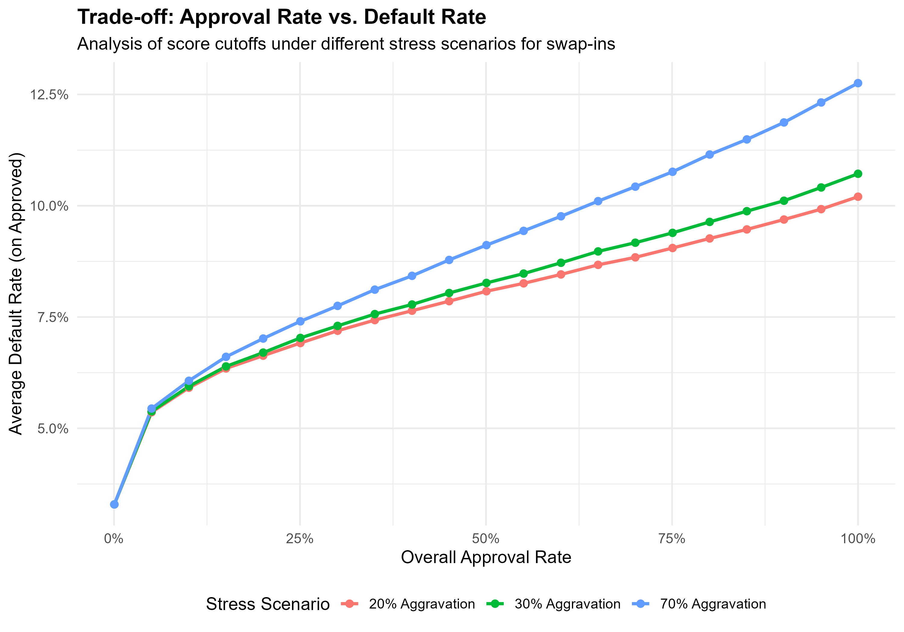

```{r, include = FALSE}
knitr::opts_chunk$set(
  collapse = TRUE,
  comment = "#>"
)
```

This vignette demonstrates how to use `creditools` to perform a trade-off analysis between approval rates and default rates under different stress scenarios and credit score cutoffs.

## 1. Setup

First, we load the necessary packages and `creditools`.

```{r setup}
# Ensure you have these packages installed:
# install.packages(c("devtools", "tidyverse", "cli", "ggplot2", "furrr", "fs"))
devtools::load_all()
library(tidyverse)
library(ggplot2)
```

## 2. Analysis Parameters

We define the parameters for our simulation. Well use a large sample size to get stable results.

```{r params, eval=FALSE}
# This is an example. For the vignette, we use a smaller sample.
N_APPLICANTS <- 5000000 # Using large sample size as requested
SEED <- 42
CUTOFF_STEP <- 50
AGGRAVATION_FACTORS <- c(1.2, 1.3, 1.7)
```

For the purpose of this vignette, we will use a much smaller dataset to keep the execution time low.

```{r params-vignette}
N_APPLICANTS <- 5000 # Smaller sample for vignette
SEED <- 42
CUTOFF_STEP <- 100
AGGRAVATION_FACTORS <- c(1.2, 1.5)
```

## 3. Data Generation

We generate a sample dataset using `generate_sample_data`.

```{r data}
analytical_base <- creditools::generate_sample_data(
  n_applicants = N_APPLICANTS,
  seed = SEED
)
# Pre-calculate deciles needed for stratified aggravation
analytical_base$decil_novo <- dplyr::ntile(analytical_base$score_novo, 10)
```

## 4. Simulation

We define a grid of parameters to simulate, with different cutoff points and aggravation factors. Then, we run the simulations. For a real analysis, you could use `future` and `furrr` to run this in parallel.

```{r simulation}
min_score <- floor(min(analytical_base$score_novo) / CUTOFF_STEP) * CUTOFF_STEP
max_score <- ceiling(max(analytical_base$score_novo) / CUTOFF_STEP) * CUTOFF_STEP
cutoff_points <- seq(min_score, max_score, by = CUTOFF_STEP)

params_grid <- tidyr::expand_grid(
  cutoff = cutoff_points,
  agg_factor = AGGRAVATION_FACTORS
)

run_single_sim <- function(cutoff_value, aggravation_factor) {
  
  temp_policy <- creditools::credit_policy(
    applicant_id_col = "id",
    score_cols = c("score_antigo", "score_novo"),
    current_approval_col = "approved",
    actual_default_col = "defaulted",
    risk_level_col = "decil_novo",
    simulation_stages = list(
      creditools::stage_cutoff(name = "credit_decision", cutoffs = list(score_novo = cutoff_value))
    ),
    stress_scenarios = list(
      creditools::stress_aggravation(factor = aggravation_factor, by = "decil_novo")
    )
  )
  
  sim_results <- creditools::run_simulation(
    data = analytical_base,
    policy = temp_policy
  )
  
  final_data <- sim_results$data
  approved_pop <- final_data %>% dplyr::filter(new_approval == TRUE)
  
  overall_approval_rate <- nrow(approved_pop) / nrow(final_data)
  avg_default_rate_approved <- if (nrow(approved_pop) > 0) {
    mean(approved_pop$simulated_default, na.rm = TRUE)
  } else {
    0
  }
  
  tibble(
    cutoff = cutoff_value,
    agg_factor = aggravation_factor,
    approval_rate = overall_approval_rate,
    default_rate = avg_default_rate_approved
  )
}

simulation_outputs <- purrr::map2_dfr(
  .x = params_grid$cutoff,
  .y = params_grid$agg_factor,
  .f = run_single_sim
)
```

## 5. Visualization

Finally, we visualize the trade-off between approval rate and default rate.

```{r plot}
plot_data <- simulation_outputs %>%
  mutate(stress_scenario = paste0(round((agg_factor - 1) * 100), "% Aggravation"))

tradeoff_plot <- ggplot(plot_data, aes(x = approval_rate, y = default_rate, color = stress_scenario)) +
  geom_line(size = 1.2) +
  geom_point(size = 2.5) +
  labs(
    title = "Trade-off: Approval Rate vs. Default Rate",
    subtitle = "Analysis of score cutoffs under different stress scenarios for swap-ins",
    x = "Overall Approval Rate",
    y = "Average Default Rate (on Approved)",
    color = "Stress Scenario"
  ) +
  scale_x_continuous(labels = scales::percent_format()) +
  scale_y_continuous(labels = scales::percent_format()) +
  theme_minimal(base_size = 14) +
  theme(
    legend.position = "bottom",
    plot.title = element_text(face = "bold")
  )

print(tradeoff_plot)
```

This plot is saved in this `vignettes` directory as `tradeoff_plot.png`.

```{r, echo=FALSE}
# The original plot from the analysis script

```
